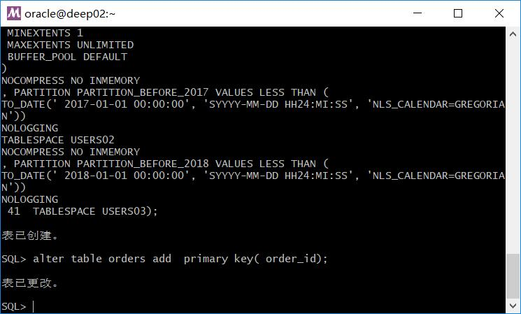
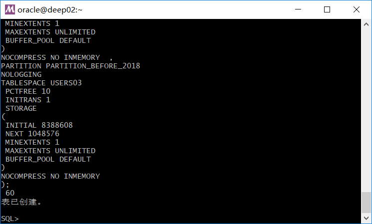
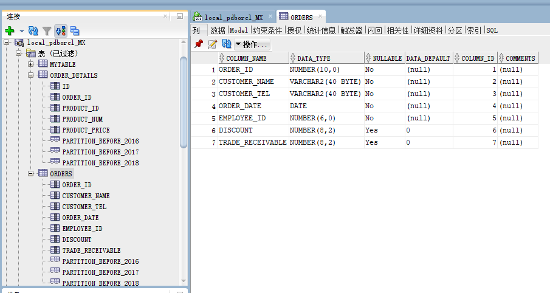
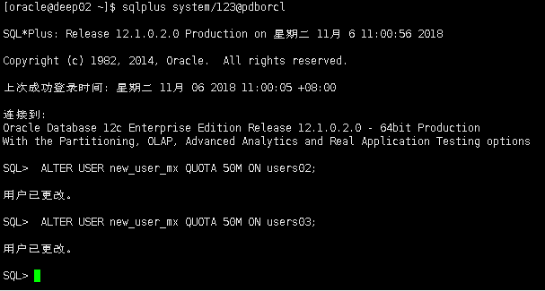
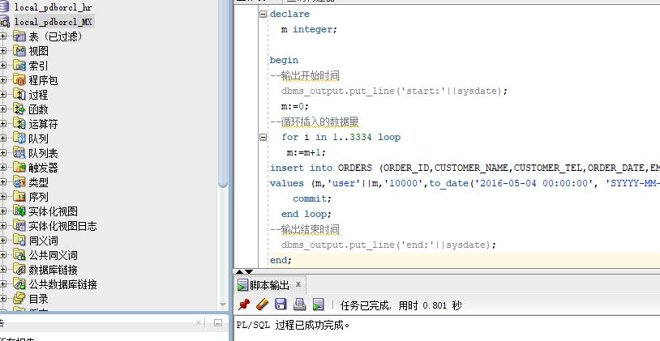
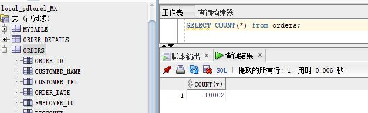
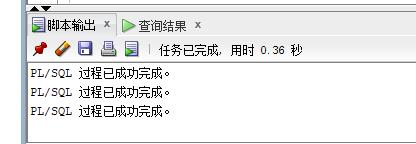
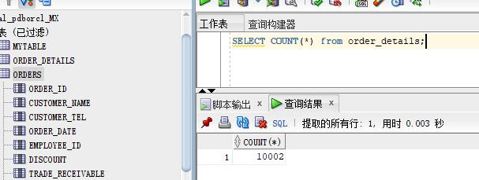
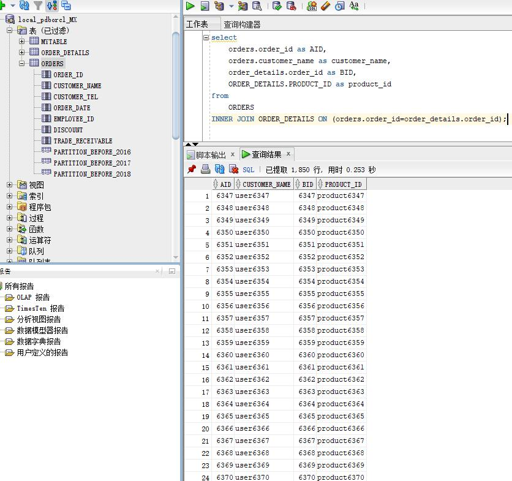

# 实验3：创建分区表

## 实验目的：

掌握分区表的创建方法，掌握各种分区方式的使用场景。

## 实验内容：
- 本实验使用3个表空间：USERS,USERS02,USERS03。在表空间中创建两张表：订单表(orders)与订单详表(order_details)。
- 使用**你自己的账号创建本实验的表**，表创建在上述3个分区，自定义分区策略。

 创建订单表(orders)：
```
SQL> CREATE TABLE orders 
(
 order_id NUMBER(10, 0) NOT NULL 
 , customer_name VARCHAR2(40 BYTE) NOT NULL 
 , customer_tel VARCHAR2(40 BYTE) NOT NULL 
 , order_date DATE NOT NULL 
 , employee_id NUMBER(6, 0) NOT NULL 
 , discount NUMBER(8, 2) DEFAULT 0 
 , trade_receivable NUMBER(8, 2) DEFAULT 0 
) 
TABLESPACE USERS 
PCTFREE 10 INITRANS 1 
STORAGE (   BUFFER_POOL DEFAULT ) 
NOCOMPRESS NOPARALLEL 
PARTITION BY RANGE (order_date) 
(
 PARTITION PARTITION_BEFORE_2016 VALUES LESS THAN (
 TO_DATE(' 2016-01-01 00:00:00', 'SYYYY-MM-DD HH24:MI:SS', 
 'NLS_CALENDAR=GREGORIAN')) 
 NOLOGGING 
 TABLESPACE USERS 
 PCTFREE 10 
 INITRANS 1 
 STORAGE 
( 
 INITIAL 8388608 
 NEXT 1048576 
 MINEXTENTS 1 
 MAXEXTENTS UNLIMITED 
 BUFFER_POOL DEFAULT 
) 
NOCOMPRESS NO INMEMORY  
, PARTITION PARTITION_BEFORE_2017 VALUES LESS THAN (
TO_DATE(' 2017-01-01 00:00:00', 'SYYYY-MM-DD HH24:MI:SS', 'NLS_CALENDAR=GREGORIAN')) 
NOLOGGING 
TABLESPACE USERS02 
NOCOMPRESS NO INMEMORY  
, PARTITION PARTITION_BEFORE_2018 VALUES LESS THAN (
TO_DATE(' 2018-01-01 00:00:00', 'SYYYY-MM-DD HH24:MI:SS', 'NLS_CALENDAR=GREGORIAN')) 
NOLOGGING 
TABLESPACE USERS03);
```
创建结果：



创建订单详表(order_details)：
```
SQL > CREATE TABLE order_details 
(
id NUMBER(10, 0) NOT NULL 
, order_id NUMBER(10, 0) NOT NULL
, product_id VARCHAR2(40 BYTE) NOT NULL 
, product_num NUMBER(8, 2) NOT NULL 
, product_price NUMBER(8, 2) NOT NULL 
, CONSTRAINT order_details_fk1 FOREIGN KEY  (order_id)
REFERENCES orders  (order_id)
ENABLE 
) 
TABLESPACE USERS 
PCTFREE 10 INITRANS 1 
STORAGE (   BUFFER_POOL DEFAULT ) 
NOCOMPRESS NOPARALLEL
PARTITION BY REFERENCE (order_details_fk1)
(
PARTITION PARTITION_BEFORE_2016 
NOLOGGING 
TABLESPACE USERS --必须指定表空间,否则会将分区存储在用户的默认表空间中
 PCTFREE 10 
 INITRANS 1 
 STORAGE 
( 
 INITIAL 8388608 
 NEXT 1048576 
 MINEXTENTS 1 
 MAXEXTENTS UNLIMITED 
 BUFFER_POOL DEFAULT 
) 
NOCOMPRESS NO INMEMORY , 
PARTITION PARTITION_BEFORE_2017 
NOLOGGING 
TABLESPACE USERS02
 PCTFREE 10 
 INITRANS 1 
 STORAGE 
( 
 INITIAL 8388608 
 NEXT 1048576 
 MINEXTENTS 1 
 MAXEXTENTS UNLIMITED 
 BUFFER_POOL DEFAULT 
) 
NOCOMPRESS NO INMEMORY  ,
PARTITION PARTITION_BEFORE_2018 
NOLOGGING 
TABLESPACE USERS03
 PCTFREE 10 
 INITRANS 1 
 STORAGE 
( 
 INITIAL 8388608 
 NEXT 1048576 
 MINEXTENTS 1 
 MAXEXTENTS UNLIMITED 
 BUFFER_POOL DEFAULT 
) 
NOCOMPRESS NO INMEMORY 
);
```
创建结果图：



SQL_Developer(表一与表二）的结果图：



- 你需要使用system用户给你自己的账号分配上述分区的使用权限。


- 表创建成功后，插入数据，数据能并平均分布到各个分区。每个表的数据都应该大于1万行，对表进行联合查询。
对orders插入数据：
```
declare 
  m integer; 

begin 
--输出开始时间 
  dbms_output.put_line('start:'||sysdate); 
  m:=0;
--循环插入的数据量 
  for i in 1..3334 loop 
   m:=m+1; 
insert into ORDERS (ORDER_ID,CUSTOMER_NAME,CUSTOMER_TEL,ORDER_DATE,EMPLOYEE_ID,DISCOUNT,TRADE_RECEIVABLE) 
values (m,'user'||m,'10000',to_date('2016-05-04 00:00:00', 'SYYYY-MM-DD HH24:MI:SS'),001,15,29);
    commit; 
  end loop; 
--输出结束时间 
  dbms_output.put_line('end:'||sysdate); 
end;
```
运行三次插入10002条数据结果如图：




对order_details进行插入数据：
```
declare 
  m integer; 
begin 

--输出开始时间 
  dbms_output.put_line('start:'||sysdate); 
  m:=0;

--循环插入的数据量 
  for i in 1..3334 loop 
   m:=m+1; 
insert into ORDER_DETAILS (ID,ORDER_ID,PRODUCT_ID,PRODUCT_NUM,PRODUCT_PRICE) 
values (m,m,'product'||m,15,29);
    commit; 
  end loop; 
--输出结束时间 
  dbms_output.put_line('end:'||sysdate); 
end;
```
插入结果查询：





联合查询：



- 写出插入数据的语句和查询数据的语句，并分析语句的执行计划。

执行计划：
```
EXPLAIN plan for
select 
    orders.order_id as AID,
    orders.customer_name as customer_name,
    order_details.order_id as BID,
    ORDER_DETAILS.PRODUCT_ID as product_id
from
    ORDERS
INNER JOIN ORDER_DETAILS ON (orders.order_id=order_details.order_id);
select * from table(dbms_xplan.display());
```
执行计划结果：


最先执行的是PARTITION REFERENCE ALL，对分区进行引用。

然后执行的是TABLE ACCESS FULL，即是优先对order_details表进行全表扫描。

其次对order_id进行索引唯一扫描，因为order_details的外键是order_id。

因为SQL语句中使用了join，所以需要进行了NESTED LOOPS连接查询。

再对orders表进行TABLE ACCESS BY GLOBAL INDEX ROWID，即rowid与索引的扫描，找出符合条件的元素。
- 进行分区与不分区的对比实验。

在建立orders 表时按照订单日期进行了范围分区，将2016以前的数据存储在users表空间中，将2016年的数据存储在users02表空间中。

由于order_details是orders的从表，通过引用分区语句PARTITION BY REFERENCE（order_details_fk1），利用外键order_details_fk1关联到主表orders，使从表按主表的分区方案与主表存储在同一分区中。

在从表中虽然没有订单日期列，但由于建立了引用分区，其数据也是按主表的日期范围进行分区存储。


